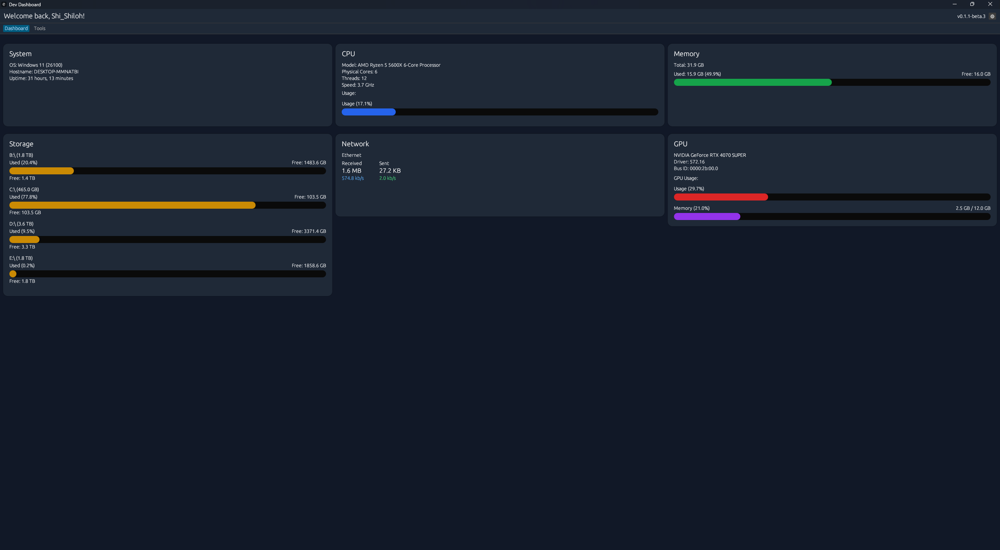

# Dev Dashboard

A system monitoring dashboard and software center for developers, built with Rust and egui.

## Features

- Real-time system monitoring:
  - CPU monitoring
  - Memory usage statistics
  - Storage space monitoring
  - Network interface statistics
  - GPU monitoring (NVIDIA GPUs only)
- Software Management:
  - One-click installation of popular development tools via Ninite
  - Pre-configured selection of essential software

## Requirements

- Windows 10 or newer
- Rust 1.70 or newer
- NVIDIA drivers (for GPU monitoring features)
- Internet connection (for software installation features)

## Development

The project uses the following key dependencies:
- `eframe` and `egui` for the UI
- `sysinfo` for system monitoring
- `nvml-wrapper` for NVIDIA GPU support
- `windows` crate for Windows-specific features
- `wmi` for Windows Management Instrumentation
- `serde` for data serialization
- `tokio` for async operations

## License

MIT License - See LICENSE file for details 